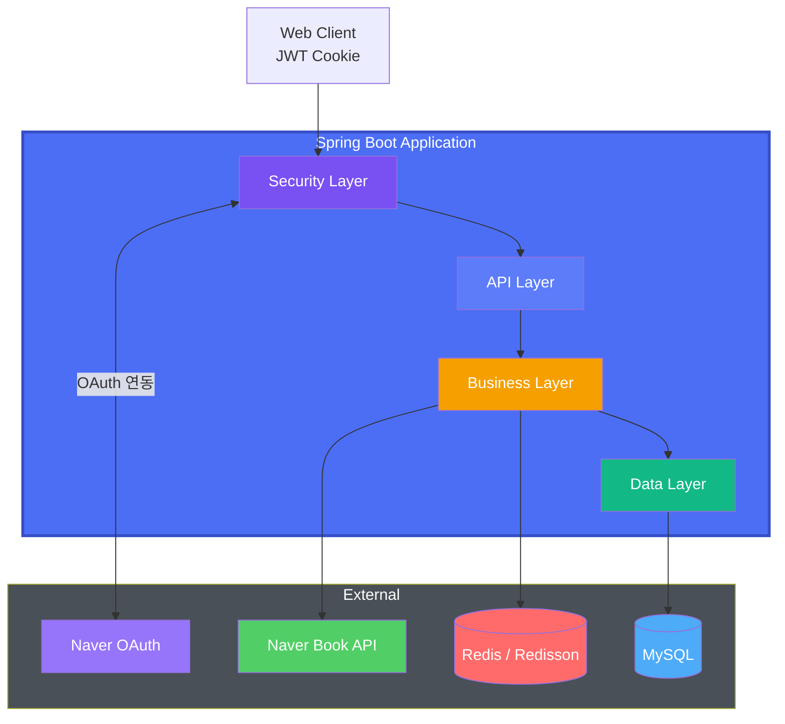

# 📚 Reading Tracker

<p align="center">
  
</p>

> 읽다 덮어 둔 종이책들, 어디까지 읽었는지 기억하시나요?

## 🔍 배경

- 책을 읽기 시작하면 완결을 잘 못한다. 그러면서 읽고 싶은 책은 많다. 책갈피만 늘어나는 중..
- 이런 식으로 독서를 하다보니 어쩔 땐 내가 어떤 책을 읽었는지, 덜 읽었는지 파악하기 어렵다.
- 심지어 책 정리하면서 중간에 책갈피 꽂힌거보고 전에 이 책을 읽다 말았구나 싶었던 적도 있다.
- 현재 내가 어떤 책들을 어느정도 읽었는지 한 눈에 파악할 수 있다면?
- eBook 애플리케이션은 eBook만 진도율 트래킹할 수 있다 → ***그럼 종이책을 대상으로 진도율을 추적해보자!***

## ✨ 핵심 기능

> 본 프로젝트는 reading-tracker 백엔드 API 서버입니다.

### 사용자 기능

- 네이버 계정 간편 로그인
- 네이버 도서 검색 기반 책 추가
- 현재 페이지 입력 시 자동 진도율 계산 및 상태 변경
- 읽는중/완료/보관 중인 도서 개수 요약

### 기술 기능

- Redis 기반 분산락으로 도서 중복 등록 방지
- OAuth2 기반 로그인 + 자체 JWT Cookie 발급
- Redis 장애 시 DB fallback 처리
- JWT HttpOnly·Secure 쿠키 기반 인증
- 캐시 기반 성능 최적화

## 🏗️ 아키텍처



## 🧰 기술 스택

- Java 21, Spring Boot 3(Web, Security, OAuth2, JPA, Cache), RestClient
- MySQL(RDS), Redis(ElastiCache), Redisson
- Gradle, Docker, GitHub Actions, AWS ECR · EC2 · SSM · ALB

## 🧪 테스트 전략

> 단위 검증은 MockMvc·DataJpaTest로, 핵심 시나리오 SpringBootTest + Testcontainers로 통합 검증합니다.

### 단위 테스트 / 슬라이스 테스트

- MockMvc 기반 Controller 테스트
- @DataJpaTest 기반 Repository/JPA 매핑 검증
- Service 단위 비즈니스 로직 테스트

### 통합 테스트

- Testcontainers Redis로 OAuth 로그인 흐름 검증
- 도서 등록 30개 동시성 환경에서 분산락 처리 검증

## 🔑 주요 API

<details>
<summary><code>GET /api/books?state=</code>: 상태 기반 도서 목록 및 상태별 통계 반환</summary>

**Request**

```
GET /api/books?state=IN_PROGRESS
Cookie: rt_token=eyJh...
```

**Response**

```json
{
  "summary": {
    "inProgress": 2,
    "completed": 5,
    "archived": 1
  },
  "books": [
    {
      "id": 1,
      "title": "리팩토링 2판",
      "author": "마틴 파울러",
      "publisher": "한빛미디어",
      "currentPage": 120,
      "totalPages": 450,
      "progress": 26,
      "state": "IN_PROGRESS"
    }
  ]
}
```

</details>

<details>
<summary><code>GET /api/books/search</code>: 네이버 도서 API 기반 도서 검색</summary>

**Request**

```
GET /api/books/search?query=클린%20코드
Cookie: rt_token=eyJh...
```

**Response**

```json
{
  "total": 1,
  "display": 1,
  "items": [
    {
      "isbn": "9788970503489",
      "title": "클린 코드",
      "author": "로버트 C. 마틴",
      "publisher": "인사이트",
      "link": "https://book.naver.com/bookdb/book_detail.nhn?bid=12345"
    }
  ]
}
```

</details>

<details>
<summary><code>POST /api/books</code>: 검색한 도서를 사용자 서재에 추가</summary>

**Request**

```json
{
  "isbn": "9788966263158",
  "title": "클린 아키텍처",
  "author": "로버트 C. 마틴",
  "publisher": "인사이트",
  "totalPages": 400
}
```

**Response**

```json
{
  "id": 42,
  "title": "클린 아키텍처",
  "author": "로버트 C. 마틴",
  "publisher": "인사이트",
  "state": "IN_PROGRESS",
  "currentPage": 1,
  "totalPages": 400
}
```

</details>

## 🚀 CI/CD 파이프라인 & 배포


## 🧪 로컬 실행 가이드

```shell
export NAVER_CLIENT_ID=
export NAVER_CLIENT_SECRET=
export JWT_SECRET_KEY=

./gradlew bootRun --args='--spring.profiles.active=dev'
```

## ⚠️ 개선 방향

- 간편 로그인 확장: 구글, 카카오
- 도서 검색 페이지네이션
- 목표 리마인더/푸시 알림
